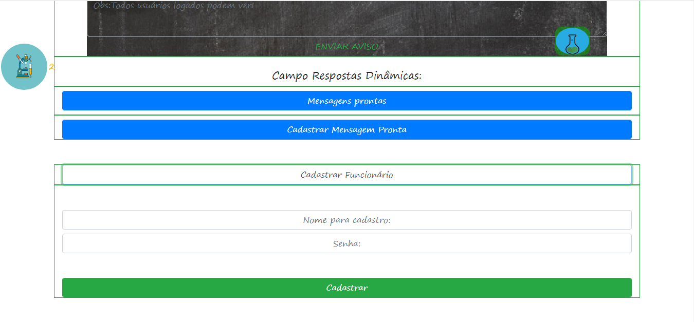

# labniveleitor
 <h1>Controle diario de fórmulas para laboratório</h1>
 <ul> 
  <li>Nível de pressão ou Lotação;</li>
  <li>Painél com Listagem de: Pastas Para Amanhã,Depois de Amanhã, Pastas com prazo longo, Pastas Atrasadas ou Falta Algo;</li>
  <li>Select de tabelas: Hoje, Amanhã, Depois de Amanhã;</li>
 <li>Transferir Dados: Tabela de Amanhã para Hoje, Tabela de Depois de Amanhã para Hoje, Tabela de Depois de Amanhã para Amanhã;</li>
 <li>Inserção De Fórmulas por Nível de Dificuldade e agilidade;</li>
 <li>Pedidos de Filiais</li>
 <li>Quadro de Aviços</li>
 <li>
  Cadastro e Dinâmica Completa de Mensagens Prontas, OBS: Tenho um repositório específico para esta opção <a href='https://github.com/Maycon-crz/AutoRespostas'>AutoRespostas</a>  </li>
 <li>Cadastro de funcionários</li>
 <li>Menu Poção Fixo com varias opções e { inclussão de fórmulas por comando de voz js }</li>
 <li>Menu em Produção fixo: com as fórmulas pré prontas iniciadas pelos botões do menu poção</li>
 <li>Por último Manual descrevendo como o sistema funciona</li>
 </ul>
 <h2>Nível de pressão ou Lotação;</h2>
 <h2>Painél com stagem de: Pastas Para Amanhã,Depois de Amanhã, Pastas com prazo longo, Pastas Atrasadas ou Falta Algo;</h2>
 <h2>Select de tabelas: Hoje, Amanhã, Depois de Amanhã;</h2>
 <h2>Transferir Dados: Tabela de Amanhã para Hoje, Tabela de Depois de Amanhã para Hoje, Tabela de Depois de Amanhã para Amanhã;</h2>
 
 <h2>Inserção De Fórmulas por Nível de Dificuldade e agilidade;</h2>
 
 <h2>Pedidos de Filiais</h2>
 <h2>Quadro de Aviços</h2>
 
 <h2>
  Cadastro e Dinâmica Completa de Mensagens Prontas, OBS: Tenho um repositório específico para esta opção <a href='https://github.com/Maycon-crz/AutoRespostas'>AutoRespostas</a>  </h2>
 <h2>Cadastro de funcionários</h2>
 
 <h2>Menu Poção Fixo com varias opções e { inclussão de fórmulas por comando de voz js }</h2>
 
 <h2>Menu em Produção fixo: com as fórmulas pré prontas iniciadas pelos botões do menu poção</h2>
  
 <h2>Por último Manual descrevendo como o sistema funciona</h2>
  <h2>P1</h2>
 
 <h2>P2</h2>
 
